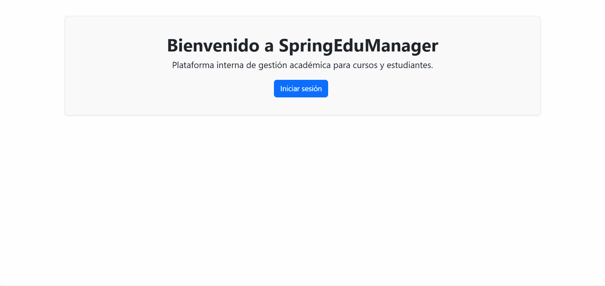

# 🎓 SpringEduManager

Aplicación web educativa desarrollada como parte de la evaluación del **Módulo #6: Desarrollo de aplicaciones JEE con Spring Framework** de Alkemy. El sistema permite gestionar de manera centralizada estudiantes, cursos y evaluaciones, sirviendo como base escalable para la arquitectura interna del campus.

---

## 🛠️ Tecnologías y Dependencias
* **Java** (JDK 25)
* **Spring Boot** (v4.1.1)
* **Spring MVC** (Controladores web y vistas)
* **Spring Data JPA** (Persistencia y repositorios)
* **Spring Security** (Control de acceso y roles `ADMIN` / `USER`)
* **Thymeleaf** (Motor de plantillas HTML)
* **H2 Database** (Base de datos embebida en memoria)
* **Maven** (Gestor de dependencias y ciclo de vida)

---


## 📂 Estructura del Proyecto

```text
SpringEduManager/
├── src/main/java/com/alkemy/edumanager/
│   ├── SpringEduManagerApplication.java    # Clase principal
│   ├── config/
│   │   └── SecurityConfig.java            # Configuración de seguridad y roles
│   ├── controller/
│   │   ├── AuthController.java            # Control de vistas de inicio y login
│   │   ├── CursoController.java           # Controlador web MVC para cursos
│   │   └── EstudianteController.java      # Controlador web MVC para estudiantes
│   ├── controller.api/
│   │   ├── CursoRestController.java       # API RESTful de cursos
│   │   └── EstudianteRestController.java  # API RESTful de estudiantes
│   ├── model/
│   │   ├── Curso.java                     # Entidad JPA Curso
│   │   ├── Estudiante.java                # Entidad JPA Estudiante
│   │   └── Evaluacion.java                # Entidad JPA Evaluación
│   ├── repository/
│   │   ├── CursoRepository.java           # Repositorio JPA de Cursos
│   │   └── EstudianteRepository.java      # Repositorio JPA de Estudiantes
│   └── service/
│       ├── CursoService.java              # Interfaz de lógica de negocio
│       ├── EstudianteService.java         # Interfaz de lógica de negocio
│       └── impl/
│           ├── CursoServiceImpl.java      # Implementación de servicios
│           └── EstudianteServiceImpl.java # Implementación de servicios
│
├── src/main/resources/
│   ├── static/                            # Recursos estáticos (CSS, JS, imágenes)
│   ├── templates/                         # Vistas HTML con Thymeleaf
│   │   ├── cursos/                        # Listado y formulario de cursos
│   │   ├── estudiantes/                   # Listado y formulario de estudiantes
│   │   ├── index.html                     # Página de bienvenida principal
│   │   └── login.html                     # Formulario de autenticación personalizado
│   └── application.properties             # Configuración de entorno y base de datos
│
└── pom.xml                                # Configuración de Maven
```

---

## 🚀 Guía de Configuración y Ejecución

### 📋 Prerrequisitos
Asegúrate de tener instalado en tu equipo lo siguiente:
* **JDK 25** o superior.
* **Maven** (o puedes utilizar el *Maven Wrapper* incluido en el proyecto: `./mvnw` en Linux/Mac o `mvnw.cmd` en Windows).
* Un entorno de desarrollo como **Spring Tool Suite (STS)**, **Eclipse** o **IntelliJ IDEA**.

### ⚙️ Paso a Paso

1. **Clonar el repositorio**
   ```bash
   git clone https://github.com/odettegallo/SpringEduManager.git
   ```

2. **Abrir el proyecto en tu IDE**
   * Abre tu IDE (por ejemplo, Spring Tool Suite).
   * Selecciona **File > Import... > Maven > Existing Maven Projects**.
   * Busca y selecciona la carpeta raíz de `SpringEduManager` y haz clic en **Finish**.

3. **Compilar y empaquetar con Maven**
   Desde la terminal ubicada en la raíz del proyecto, ejecuta:
   ```bash
   mvn clean install
   ```
   > *Nota: Si no tienes Maven instalado globalmente, puedes usar `./mvnw clean install` en Linux/Mac o `mvnw.cmd clean install` en Windows.*

4. **Ejecutar la aplicación**
   * **Desde la terminal:**
     ```bash
     mvn spring-boot:run
     ```
   * **Desde el IDE:** Haz clic derecho sobre la clase principal `SpringEduManagerApplication.java`, selecciona **Run As** y luego **Spring Boot App**.

5. **Acceder a la plataforma**
   Una vez que el servidor se haya iniciado correctamente, abre tu navegador web e ingresa a:
   🔗 [http://localhost:8080/](http://localhost:8080/)

---

## 🔑 Credenciales de Acceso

El sistema cuenta con usuarios configurados en memoria (`InMemoryUserDetailsManager`) para probar los distintos roles:

| Rol | Usuario | Contraseña | Permisos |
| :--- | :--- | :--- | :--- |
| **USER** (Estudiante) | `estudiante` | `user123` | Acceso general a vistas y catálogos. |
| **ADMIN** (Administrador) | `admin` | `admin123` | Permisos exclusivos para registrar nuevos cursos en `/cursos/nuevo`. |

---

## 📌 Progreso por Etapas (Módulo 6)

* **Lección 1:** Configuración inicial del proyecto con *Spring Initializr* y gestión de dependencias en Maven (`pom.xml`).
* **Lección 2:** Implementación del patrón MVC utilizando Thymeleaf para las vistas y anotaciones `@Controller`, `@GetMapping` y `@PostMapping`.
* **Lección 3:** Capa de acceso a datos conectada a una base de datos embebida H2 mediante *Spring Data JPA* e interfaces `JpaRepository`.
* **Lección 4:** Seguridad perimetral implementada con *Spring Security*, controlando rutas exclusivas para administradores y vistas de login/logout personalizadas.
* **Lección 5:** Exposición de servicios de interoperabilidad mediante `@RestController` para operaciones CRUD completas en formato JSON.

---

## 🎥 Demostración

<div align="center">
  
</div>
